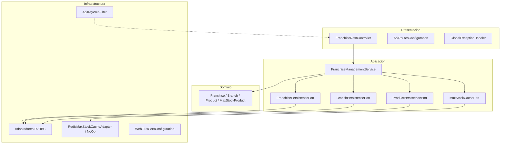

# Franchise Management API

API **reactiva** en **Java 21** con **Spring Boot 3** (**WebFlux**, **R2DBC**, **MySQL**, **Redis** opcional según perfil) para gestionar **franquicias**, **sucursales** y **productos** (stock). El diseño sigue **arquitectura limpia** (dominio centrado, puertos y adaptadores).

---

## Tabla de contenidos

1. [Arquitectura](#arquitectura)
2. [Roadmap de fases](#roadmap-de-fases-15)
3. [Fase 5: qué se añadió](#fase-5-qué-se-añadió)
4. [Prerrequisitos e instalación](#prerrequisitos-e-instalación)
5. [Ejecución local (Maven)](#ejecución-local-maven)
6. [Docker y Docker Compose](#docker-y-docker-compose)
7. [Seguridad opcional (API key)](#seguridad-opcional-api-key)
8. [Observabilidad (Prometheus / Actuator)](#observabilidad-prometheus--actuator)
9. [Pruebas](#pruebas)
10. [CI (GitHub Actions)](#ci-github-actions)
11. [Terraform (IaC)](#terraform-iac)
12. [Firebase e Ionic (orientación)](#firebase-e-ionic-orientación)

---

## Arquitectura

### Principios

- **Dominio puro** (`domain`): registros inmutables y excepciones de negocio; sin anotaciones de Spring ni infraestructura.
- **Aplicación** (`application`): casos de uso (`FranchiseManagementService`) y **puertos de salida** (`FranchisePersistencePort`, `BranchPersistencePort`, `ProductPersistencePort`, `MaxStockCachePort`).
- **Infraestructura** (`infrastructure`): adaptadores R2DBC, Redis, filtros (`ApiKeyWebFilter`), CORS, OpenAPI, configuración de repositorios.
- **Presentación** (`presentation`): REST (`FranchiseRestController`), DTOs, manejo global de errores, rutas de smoke (`/api/v1/ping`).

Las dependencias apuntan **hacia dentro**: infraestructura y presentación conocen la aplicación; el dominio no conoce frameworks.

### Diagrama de capas



### Perfiles Spring

| Perfil | Uso |
|--------|-----|
| `phase1` (por defecto) | Arranque sin MySQL ni Redis; solo `GET /api/v1/ping` y Actuator. |
| `api` | API completa contra **MySQL** y **Redis** en `localhost` (según `application.yml`). |
| `docker` | Despliegue con **Docker Compose** (hosts `mysql` y `redis`). |
| `testcontainers` | Tests de integración con MySQL en contenedor (sin Redis; caché no-op). |

Los beans de negocio (persistencia, REST, caché, CORS, OpenAPI, filtro API key) llevan `@Profile("!phase1")`.

---

## Roadmap de fases 

| Fase | Contenido |
|------|-----------|
| **1** | Proyecto base, perfil `phase1`, `GET /api/v1/ping`, Actuator. |
| **2** | Dominio, puertos, R2DBC + MySQL, API REST completa (CRUD + informe máximo stock). |
| **3** | Caché Redis + invalidación, CORS, Docker + Compose, Terraform mínimo, notas Firebase. |
| **4** | GitHub Actions (CI), CORS vía `app.cors`, metadatos OpenAPI, health **probes** para Kubernetes. |
| **5** | **Prometheus** (`micrometer-registry-prometheus`), **seguridad opcional** por cabecera `X-API-Key` (`ApiKeyWebFilter`), documentación de instalación/ejecución y pruebas ampliada. |

---

## Fase 5: qué se añadió

1. **Métricas Prometheus**  
   - Dependencia `micrometer-registry-prometheus`.  
   - Actuator expone `GET /actuator/prometheus` (incluido en `management.endpoints.web.exposure.include`).  
   - Etiqueta global `application` en métricas (`management.metrics.tags.application`).

2. **Seguridad opcional sin Spring Security**  
   - Filtro reactivo `ApiKeyWebFilter` (`@Profile("!phase1")`).  
   - Propiedades `app.security.enabled` y `app.security.api-key` (también vía variables de entorno `APP_SECURITY_ENABLED`, `APP_SECURITY_API_KEY`).  
   - Si `enabled=true` y la clave no está vacía, las rutas **no públicas** exigen cabecera `X-API-Key` con el mismo valor.  
   - Rutas públicas: `OPTIONS`, `/actuator/**`, `/api/v1/ping`, `/api/v1/docs/**`, `/webjars/**`, `/swagger-ui**`.  
   - Objetivo: no bloquear Actuator ni Swagger y evitar el auto-config agresivo de `spring-boot-starter-security`.

3. **Docker Compose**  
   - Comentarios de ejemplo para activar API key en el servicio `app`.

4. **Prueba unitaria** del filtro: `ApiKeyWebFilterTest`.

5. **README** (este documento): arquitectura, pruebas, instalación y guía Docker.

---

## Prerrequisitos e instalación

| Herramienta | Versión recomendada |
|-------------|---------------------|
| **JDK** | 21 (Temurin u otra distribución compatible) |
| **Maven** | 3.9+ |
| **Docker Desktop** (opcional) | Para Compose y tests `-Pintegration` |

Clonar el repositorio y, en la raíz del proyecto:

```bash
mvn -q -DskipTests package
```

No hace falta instalar MySQL/Redis en el equipo si solo ejecutas `mvn test` (perfil por defecto `phase1`) o usas **Docker Compose** para el stack completo.

---

## Ejecución local (Maven)

### Solo smoke (sin bases de datos)

```bash
mvn spring-boot:run
```

Por defecto está activo el perfil **`phase1`**: no se cargan R2DBC, Redis ni la API de franquicias; responden `GET /api/v1/ping` y `GET /actuator/health`.

### API completa en tu máquina

1. Crea en MySQL la base **`franchise_db`** y el usuario/contraseña definidos en `src/main/resources/application.yml` (o ajusta credenciales).  
2. Levanta **Redis** en `localhost:6379`.  
3. Arranca:

```bash
mvn spring-boot:run -Dspring-boot.run.profiles=api
```

- Swagger UI: `http://localhost:8080/api/v1/docs/swagger-ui.html`  
- OpenAPI JSON: `http://localhost:8080/api/v1/docs/openapi`  
- Prometheus scrape: `http://localhost:8080/actuator/prometheus`

### Con API key (opcional)

```bash
mvn spring-boot:run -Dspring-boot.run.profiles=api ^
  -Dspring-boot.run.arguments=--app.security.enabled=true --app.security.api-key=mi-clave-secreta
```

(Linux/macOS: sustituye `^` por `\` o usa comillas en una sola línea.)

Las peticiones a `/api/v1/franchises/**` deben incluir `X-API-Key: mi-clave-secreta` (salvo rutas públicas listadas arriba).

---

## Docker y Docker Compose

### Construir imagen (Fase 3–5)

El `Dockerfile` compila con Maven en una etapa y ejecuta el JAR con **JRE 21**.

```bash
docker build -t franchise-management-api:local .
```

### Levantar MySQL + Redis + API

```bash
docker compose up --build
```

- API: `http://localhost:8080` con perfil **`docker`** (URLs R2DBC/Redis a servicios `mysql` y `redis`).  
- El esquema SQL se aplica al arranque (`spring.sql.init`).

Para activar **API key** en contenedores, edita `docker-compose.yml` en el servicio `app` y descomenta (o añade) las variables:

```yaml
environment:
  SPRING_PROFILES_ACTIVE: docker
  APP_SECURITY_ENABLED: "true"
  APP_SECURITY_API_KEY: "cambia-esto-en-produccion"
```

Reinicia el stack (`docker compose up -d --build`).

---

## Seguridad opcional (API key)

| Propiedad / env | Descripción |
|-----------------|-------------|
| `app.security.enabled` / `APP_SECURITY_ENABLED` | `true` para activar el filtro (junto con clave no vacía). |
| `app.security.api-key` / `APP_SECURITY_API_KEY` | Valor secreto; el cliente debe enviar `X-API-Key` idéntico. |

En producción: usa secretos del orquestador (Kubernetes Secrets, AWS Secrets Manager, etc.) y **restringe CORS** (`app.cors.allowed-origin-patterns`) al origen de tu app Ionic.

---

## Observabilidad (Prometheus / Actuator)

- **Health**: `/actuator/health` (con grupos de **liveness/readiness** si el entorno lo soporta gracias a `management.endpoint.health.probes.enabled=true`).  
- **Métricas Prometheus**: `/actuator/prometheus`.  
- **Info / métricas**: incluidos en `management.endpoints.web.exposure.include`.

---

## Pruebas

### Unitarias (incluidas en `mvn test`)

| Clase | Qué valida |
|--------|------------|
| `FranchiseManagementApplicationTest` | Contexto con perfil `phase1`, `GET /api/v1/ping` y Actuator. |
| `FranchiseManagementServiceTest` | Casos de uso con puertos simulados (Mockito + StepVerifier): creación de franquicia, informe de stock, caché, validación de stock negativo, etc. |
| `ApiKeyWebFilterTest` | Filtro API key: desactivado, rechazo sin clave, aceptación con cabecera, rutas públicas. |

### Integración (Testcontainers + MySQL)

Requiere **Docker** en el equipo:

```bash
mvn test -Pintegration
```

`FranchiseApiIntegrationTest` está etiquetada con `@Tag("integration")` y no se ejecuta en el `mvn test` por defecto.

---

## CI (GitHub Actions)

El workflow `.github/workflows/ci.yml` ejecuta `mvn test` en **push** y **pull request** a las ramas `main`, `master` y `develop` (Java 21 Temurin, caché Maven).

---

## Terraform (IaC)

Plantilla mínima en `infra/terraform` (recurso `random_pet` + `output`) como base para nombrar recursos en la nube. Ampliación típica: RDS/Aurora MySQL, ElastiCache Redis, balanceador y servicio de cómputo (ECS, Cloud Run, AKS, etc.).

```bash
cd infra/terraform
terraform init
terraform apply
```

---

## Firebase e Ionic (orientación)

- **Remote Config / flags**: suelen resolverse en el cliente; la API permanece HTTP estándar.  
- **Auth**: validación de **ID token** JWT en backend es opcional (`firebase-admin` + `WebFilter`); no está incluido en el código base para no exigir credenciales de proyecto en la prueba.  
- **CORS**: configurar `app.cors` para el dominio de la app híbrida.

---

## Endpoints principales

| Método | Ruta | Descripción |
|--------|------|-------------|
| GET | `/api/v1/ping` | Smoke (siempre disponible con perfil `phase1` o superior). |
| POST | `/api/v1/franchises` | Crear franquicia |
| PATCH | `/api/v1/franchises/{id}` | Renombrar franquicia |
| POST | `/api/v1/franchises/{id}/branches` | Añadir sucursal |
| PATCH | `/api/v1/franchises/{id}/branches/{branchId}` | Renombrar sucursal |
| POST | `/api/v1/franchises/.../products` | Añadir producto |
| DELETE | `/api/v1/franchises/.../products/{productId}` | Eliminar producto |
| PATCH | `/api/v1/franchises/.../products/{productId}/stock` | Stock |
| PATCH | `/api/v1/franchises/.../products/{productId}` | Nombre producto |
| GET | `/api/v1/franchises/{id}/reports/max-stock-by-branch` | Máximo stock por sucursal (caché Redis si está disponible) |

---

## Estructura de paquetes

```
com.franchise.management
├── domain/
├── application/          # puertos (port.out) + FranchiseManagementService
├── infrastructure/       # R2DBC, Redis, seguridad (ApiKeyWebFilter), CORS, OpenAPI
└── presentation/         # REST, DTOs, errores, ping
```


